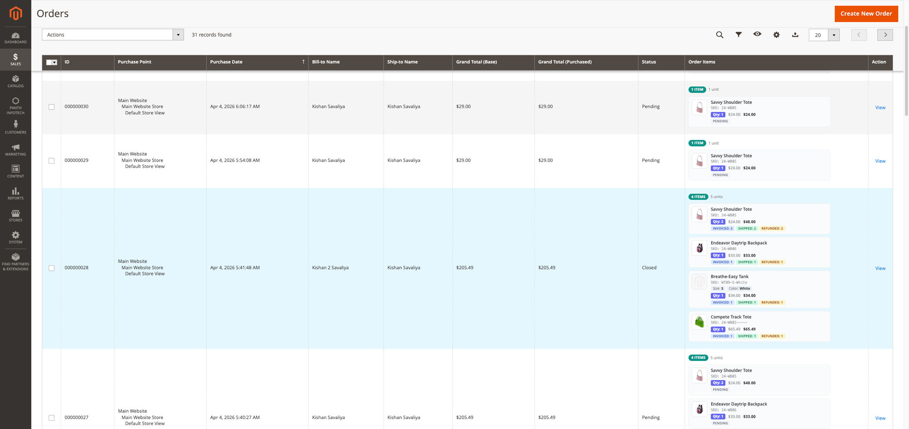
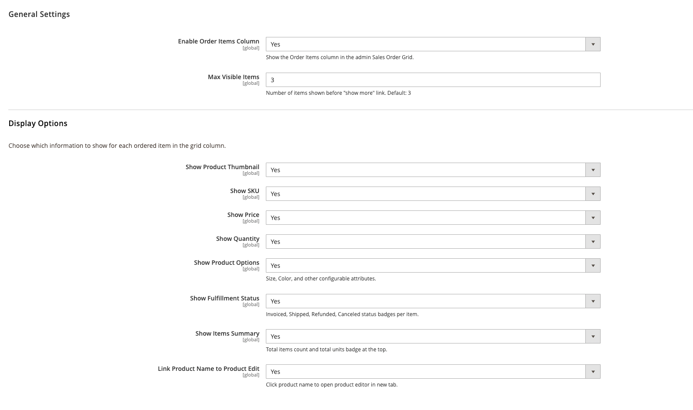

<!-- SEO Meta -->
<!--
  Title: Panth Ordered Items — Order Items Column for Magento 2 Admin Sales Grid
  Description: Display product thumbnails, names, SKUs, quantities, prices, options, and fulfillment status directly in the Magento 2 admin order grid. Fully configurable — no code changes needed.
  Keywords: magento 2 order grid, order items column, admin order grid enhancement, magento 2 ordered items, sales grid products, order grid thumbnails, magento 2 admin customization
  Author: Kishan Savaliya (Panth Infotech)
-->

# Panth Ordered Items — Order Items Column for Magento 2 Admin Sales Grid

[](https://magento.com)
[](https://php.net)
[]()
[](https://packagist.org/packages/mage2kishan/module-ordered-items)
[](https://www.upwork.com/freelancers/~016dd1767321100e21)
[](https://www.upwork.com/agencies/1881421506131960778/)
[](https://kishansavaliya.com)
[](https://kishansavaliya.com/get-quote)

> See what was ordered **without opening the order**. This extension adds a rich "Order Items" column to the Magento 2 admin Sales Order Grid — showing product thumbnails, names, SKUs, quantities, prices, configurable options (size, color), and per-item fulfillment status (pending, invoiced, shipped, refunded, canceled) — all at a glance.

Stop clicking into every order just to see what was purchased. **Panth Ordered Items** gives store owners instant visibility into order contents directly from the grid. Every detail is admin-configurable — toggle thumbnails, prices, SKUs, fulfillment badges, and more from `Stores > Configuration > Panth Extensions > Ordered Items Grid`.

## Preview



*Order Items column showing product thumbnails, names, SKUs, quantities, prices, configurable options, and fulfillment status badges — all inline in the admin order grid.*

---

## 🚀 Need Custom Magento 2 Development?

<p align="center">
  <a href="https://kishansavaliya.com/get-quote">
    
  </a>
</p>

<table>
<tr>
<td width="50%" align="center">

### 🏆 Kishan Savaliya
**Top Rated Plus on Upwork**

[](https://www.upwork.com/freelancers/~016dd1767321100e21)

</td>
<td width="50%" align="center">

### 🏢 Panth Infotech Agency

[](https://www.upwork.com/agencies/1881421506131960778/)

</td>
</tr>
</table>

---

## Table of Contents

- [Key Features](#key-features)
- [What You See in the Grid](#what-you-see-in-the-grid)
- [Compatibility](#compatibility)
- [Installation](#installation)
- [Configuration](#configuration)
- [How It Works](#how-it-works)
- [Troubleshooting](#troubleshooting)
- [FAQ](#faq)
- [Support](#support)

---

## Key Features

- **Product Thumbnails** — see what was ordered at a glance without opening the order
- **Product Names** — clickable, opens product editor in a new tab
- **SKU Display** — instantly identify products by their SKU codes
- **Quantity & Pricing** — ordered qty, unit price, and row total with dynamic currency
- **Configurable Options** — shows Size, Color, and other product options inline
- **Fulfillment Status Badges** — color-coded per-item status: Pending, Invoiced, Shipped, Refunded, Canceled
- **Items Summary** — total items count and total units badge at the top of each cell
- **Collapsible "Show More"** — orders with many items show first 3 and a "show more" link
- **Click Prevention** — clicking the Order Items column does NOT open the order view
- **Fully Admin-Configurable** — toggle every element on/off from system config
- **Dynamic Currency** — prices formatted using the order's actual currency (USD, EUR, GBP, etc.)
- **Zero Configuration Required** — install and it works out of the box with sensible defaults
- **MEQP Compliant** — passes Adobe Marketplace code quality standards
- **Lightweight** — no database tables, no cron jobs, no frontend impact

---

## What You See in the Grid

Each order row shows an "Order Items" column with:

```
┌─────────────────────────────────────────────┐
│  3 items  •  5 units                        │
│                                             │
│  [IMG] Savvy Shoulder Tote                  │
│        SKU: 24-WB05                         │
│        Size: M  •  Color: White             │
│        Qty: 2  •  $24.00  •  $48.00         │
│        INVOICED: 2  SHIPPED: 2              │
│                                             │
│  [IMG] Endeavor Daytrip Backpack            │
│        SKU: 24-WB06                         │
│        Qty: 1  •  $33.00  •  $33.00         │
│        INVOICED: 1  SHIPPED: 1  REFUNDED: 1 │
│                                             │
│  [IMG] Compete Track Tote                   │
│        SKU: 24-MB02                         │
│        Qty: 2  •  $32.00  •  $64.00         │
│        PENDING                              │
│                                             │
└─────────────────────────────────────────────┘
```

---

## Compatibility

| Requirement | Versions Supported |
|---|---|
| Magento Open Source | 2.4.4, 2.4.5, 2.4.6, 2.4.7, 2.4.8 |
| Adobe Commerce | 2.4.4, 2.4.5, 2.4.6, 2.4.7, 2.4.8 |
| Adobe Commerce Cloud | 2.4.4 — 2.4.8 |
| PHP | 8.1, 8.2, 8.3, 8.4 |
| Panth Core | ^1.0 (installed automatically) |

---

## Installation

### Composer (recommended)

```bash
composer require mage2kishan/module-ordered-items
bin/magento module:enable Panth_OrderedItems
bin/magento setup:upgrade
bin/magento setup:di:compile
bin/magento cache:flush
```

### Manual Installation

1. Download and extract to `app/code/Panth/OrderedItems/`
2. Run the enable commands above

### Verify

```bash
bin/magento module:status Panth_OrderedItems
# Module is enabled
```

Navigate to **Sales > Orders** — the "Order Items" column appears automatically.

---

## Configuration

Navigate to **Stores > Configuration > Panth Extensions > Ordered Items Grid**.



*Every element in the Order Items column is independently toggleable from admin config.*

### General Settings

| Setting | Default | Description |
|---|---|---|
| Enable Order Items Column | Yes | Show/hide the column in the order grid |
| Max Visible Items | 3 | Items shown before the "show more" link |

### Display Options

| Setting | Default | Description |
|---|---|---|
| Show Product Thumbnail | Yes | Product image in each item row |
| Show SKU | Yes | Product SKU code |
| Show Price | Yes | Unit price and row total with dynamic currency |
| Show Quantity | Yes | Ordered quantity badge |
| Show Product Options | Yes | Size, Color, and other configurable attributes |
| Show Fulfillment Status | Yes | Invoiced/Shipped/Refunded/Canceled badges |
| Show Items Summary | Yes | Total items and units count badge |
| Link Product Name | Yes | Click product name to open editor in new tab |

---

## How It Works

The extension adds a virtual column to the `sales_order_grid` UI component via XML. The `OrderItems` column class:

1. Receives each order row's `entity_id` during `prepareDataSource()`
2. Loads the order's visible items via `OrderRepositoryInterface`
3. For each item, renders HTML with thumbnail, name, SKU, options, price, and status
4. Uses `event.stopPropagation()` to prevent row clicks from navigating away
5. Respects all admin configuration toggles
6. Formats prices using Magento's `PriceCurrencyInterface` with the order's actual currency

**Performance:** The column loads order items on-demand when the grid renders. For stores with very high order volumes, consider limiting the grid page size to 20-50 rows.

---

## Fulfillment Status Badges

Each item shows color-coded fulfillment badges:

| Badge | Color | Meaning |
|---|---|---|
| **Pending** | Gray | Not yet invoiced or shipped |
| **Invoiced: N** | Blue | N items invoiced |
| **Shipped: N** | Green | N items shipped |
| **Refunded: N** | Amber | N items refunded |
| **Canceled: N** | Red | N items canceled |

Multiple badges can appear simultaneously (e.g., "Invoiced: 2, Shipped: 1, Refunded: 1").

---

## Troubleshooting

| Issue | Solution |
|---|---|
| Column not visible | Check Stores > Config > Panth Extensions > Ordered Items Grid > Enable = Yes |
| Column visible but empty | Run `bin/magento setup:di:compile && bin/magento cache:flush` |
| Thumbnails show placeholder | Products may not have images uploaded, or images need reindexing |
| Prices show wrong currency | The column uses the order's currency — verify the order was placed with the correct currency |
| "show more" link not working | Clear browser cache and static content: `bin/magento setup:static-content:deploy -f` |
| Column too wide | Adjust max_visible to show fewer items, or disable some display options |

---

## FAQ

### Does this slow down the order grid?

Minimally. The column loads order items for each visible row (typically 20-50 orders). For very large catalogs, you can disable thumbnails to reduce image loading.

### Does it work with configurable, bundle, and grouped products?

Yes. Configurable products show their selected options (Size, Color). Bundle products show their bundle selections. Grouped products show individual items.

### Can I disable specific elements like prices or SKUs?

Yes. Every element is independently toggleable from admin config. You can show only thumbnails and names if you prefer a minimal view.

### Does it modify the sales_order_grid database table?

No. The column is purely virtual — it renders at display time using the order repository. No database schema changes.

### Does it work with third-party order management extensions?

Yes. It reads from Magento's standard `OrderRepositoryInterface` and does not modify any order data.

### Will it conflict with other grid customization extensions?

No. It adds a new column without modifying existing columns. It uses Magento's standard UI component extension mechanism.

---

## Support

| Channel | Contact |
|---|---|
| Email | kishansavaliyakb@gmail.com |
| Website | [kishansavaliya.com](https://kishansavaliya.com) |
| WhatsApp | +91 84012 70422 |
| GitHub Issues | [github.com/mage2sk/module-ordered-items/issues](https://github.com/mage2sk/module-ordered-items/issues) |
| Upwork (Top Rated Plus) | [Hire Kishan Savaliya](https://www.upwork.com/freelancers/~016dd1767321100e21) |
| Upwork Agency | [Panth Infotech](https://www.upwork.com/agencies/1881421506131960778/) |

### Need Custom Magento Development?

<p align="center">
  <a href="https://kishansavaliya.com/get-quote">
    
  </a>
</p>

---

## License

Proprietary — see `LICENSE.txt`. One license per Magento production installation.

---

## About Panth Infotech

Built and maintained by **Kishan Savaliya** — [kishansavaliya.com](https://kishansavaliya.com) — **Top Rated Plus** Magento developer on Upwork with 10+ years of eCommerce experience.

**Panth Infotech** specializes in high-quality Magento 2 extensions and themes for Hyva and Luma storefronts. Browse our full catalog of 35+ extensions on [Packagist](https://packagist.org/packages/mage2kishan/) and the [Adobe Commerce Marketplace](https://commercemarketplace.adobe.com).

### Quick Links

- 🌐 [kishansavaliya.com](https://kishansavaliya.com)
- 💬 [Get a Quote](https://kishansavaliya.com/get-quote)
- 👨‍💻 [Upwork Profile](https://www.upwork.com/freelancers/~016dd1767321100e21)
- 🏢 [Panth Infotech Agency](https://www.upwork.com/agencies/1881421506131960778/)
- 📦 [All Packages on Packagist](https://packagist.org/packages/mage2kishan/)
- 🐙 [GitHub](https://github.com/mage2sk)

---

**SEO Keywords:** magento 2 order grid, order items column, admin order grid enhancement, magento 2 ordered items, sales grid product thumbnails, order grid fulfillment status, magento 2 admin customization, order items in grid, panth ordered items, magento 2 order details grid, magento 2.4.8 order grid, order grid sku display, order grid product options, magento admin order enhancement, mage2kishan, panth infotech, hire magento developer, top rated plus upwork, magento 2 extension developer
