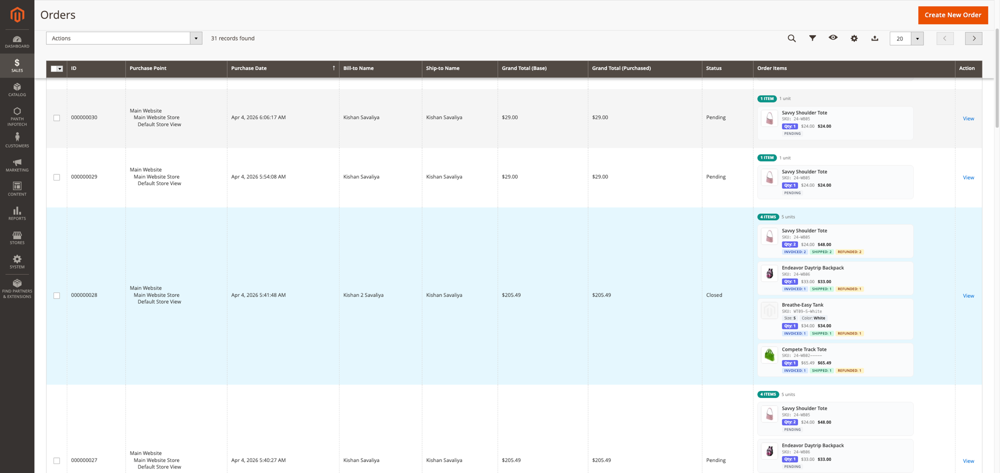
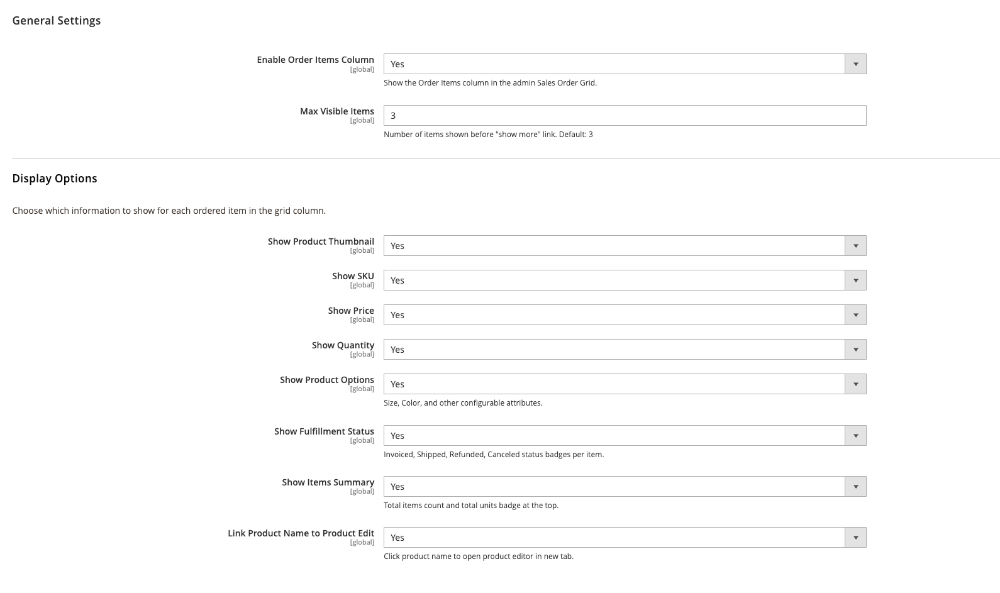

# Magento 2 Ordered Items

Panth Ordered Items adds an "Order Items" column to the admin Sales Order Grid (Sales > Orders). For every order row it renders the visible order items with product thumbnail, product name, SKU, selected options, quantity, unit price, row total and per-item fulfillment status, so an administrator can see what an order contains without opening the order view page.

The module changes only the admin order grid. It does not touch the storefront, checkout or customer account, so it works with any storefront theme, including Hyva and Luma. It is intended for store managers and fulfillment staff who work from the order list.

Product page: [kishansavaliya.com/magento-2-ordered-items.html](https://kishansavaliya.com/magento-2-ordered-items.html)

## Features

- Adds a non-sortable, non-filterable "Order Items" column to the `sales_order_grid` UI component listing.
- Shows, per item: a 32x32 product thumbnail (placeholder image when the product has none), product name, SKU, quantity, unit price and row total formatted in the order currency.
- Shows configurable attribute values (for example Size and Color) and bundle selections, up to four option lines per item.
- Shows fulfillment badges per item: "Invoiced", "Shipped", "Refunded" and "Canceled" with the quantity in each state, or "Pending" when no quantity has been processed.
- Shows a summary line per order with the number of distinct items and the total number of units.
- Product thumbnail and product name can link to the product edit page, opened in a new tab.
- Inline "+ N more items" / "Show less" toggle when an order has more items than the configured inline limit.
- Paginated popup ("View all N items") for orders with more items than the configured popup threshold; the popup has a per-page selector (10, 20, 50, All), previous/next navigation, a header with order number, item count, unit count and grand total, and closes on the close button, the Escape key or a click on the backdrop.
- Every display element can be turned on or off from admin configuration; the whole column can be disabled with one setting.
- The column is included in the grid's CSV and XML export as plain text ("Name (SKU) x Qty" per item, separated by semicolons).
- The popup is an accessible dialog: focus moves into it, Tab stays inside it, Escape or the close button closes it and focus returns to the "View all" button.
- No database tables, no observers, no cron jobs and no console commands.

Screenshots from this repository:





A short screen recording of the popup is included at `docs/order-items-popup-demo.mp4`.

## Compatibility

| Platform | Versions |
|---|---|
| Magento Open Source | 2.4.4, 2.4.5, 2.4.6, 2.4.7, 2.4.8 |
| Adobe Commerce | 2.4.4, 2.4.5, 2.4.6, 2.4.7, 2.4.8 |
| PHP | 8.1, 8.2, 8.3, 8.4 |
| Themes | Admin only; independent of the storefront theme (Hyva, Luma or other) |

Composer constraints for Magento packages: `magento/framework` ^103.0, `magento/module-backend` ^102.0, `magento/module-config` ^101.2, `magento/module-sales` ^103.0, `magento/module-catalog` ^103.0 or ^104.0, `magento/module-ui` ^101.2.

## Requirements

- Magento Open Source or Adobe Commerce 2.4.4 to 2.4.8
- PHP ~8.1.0, ~8.2.0, ~8.3.0 or ~8.4.0
- `mage2kishan/module-core` ^1.0 (installed automatically by Composer; provides the "Panth Extensions" configuration tab)
- `magento/framework` ^103.0, `magento/module-backend` ^102.0, `magento/module-config` ^101.2, `magento/module-sales` ^103.0, `magento/module-catalog` ^103.0 or ^104.0, `magento/module-ui` ^101.2

## Installation

```bash
composer require mage2kishan/module-ordered-items
bin/magento module:enable Panth_Core Panth_OrderedItems
bin/magento setup:upgrade
bin/magento setup:di:compile
bin/magento setup:static-content:deploy -f
bin/magento cache:flush
```

`setup:di:compile` is only needed when Magento runs in production mode. The module ships CSS and JavaScript under `view/adminhtml/web`, so `setup:static-content:deploy` is required in production mode; in developer mode static files are generated on request.

Check that the module is enabled:

```bash
bin/magento module:status Panth_OrderedItems
```

After installation the "Order Items" column is visible in Sales > Orders. It can be hidden or shown like any other grid column through the "Columns" control of the grid.

## Configuration

Admin path: Stores > Configuration > Panth Extensions > Ordered Items Grid. All settings are available in the Default scope only (no website or store view overrides). Access requires the ACL resource "Panth Ordered Items Grid" (`Panth_OrderedItems::config`).

### General Settings

| Setting | Default | What it does |
|---|---|---|
| Enable Order Items Column | Yes | Shows the column in the grid and in the CSV/XML export. When set to No the column is removed from the grid, the column picker and the export. The other settings are only shown while this is Yes. |
| Max Visible Items (Inline) | 3 | Number of items shown before the inline "+ N more items" toggle. In popup mode this is also the number of items shown in the grid cell above the "View all" link. |
| Popup Threshold | 10 | When an order has more items than this number, the remaining items are shown in the paginated popup instead of inline. |

Config paths: `panth_ordered_items/general/enabled`, `panth_ordered_items/general/max_visible`, `panth_ordered_items/general/popup_threshold`.

Both numbers are required and must be whole numbers greater than 0; the form shows a validation message otherwise. A stored value of 0 or an empty value falls back to 3 and 10 respectively.

### Display Options

| Setting | Default | What it does |
|---|---|---|
| Show Product Thumbnail | Yes | Shows the product thumbnail image for each item. |
| Show SKU | Yes | Shows the item SKU. |
| Show Price | Yes | Shows the unit price and the row total in the order currency. |
| Show Quantity | Yes | Shows the ordered quantity. |
| Show Product Options | Yes | Shows configurable attribute values and bundle selections (up to four per item). |
| Show Fulfillment Status | Yes | Shows the Invoiced, Shipped, Refunded, Canceled or Pending badges per item. |
| Show Items Summary | Yes | Shows the item count and unit count at the top of the cell. |
| Link Product Name to Product Edit | Yes | Makes the product name and thumbnail a link to the product edit page (new tab). |

Config paths: `panth_ordered_items/display/show_thumbnail`, `show_sku`, `show_price`, `show_qty`, `show_options`, `show_fulfillment`, `show_summary`, `show_product_link`.

With the shipped defaults every element is enabled, so the column is fully populated right after installation.

The module adds no admin menu entry and no separate admin grid; the only admin pages it touches are the Sales > Orders grid and the configuration section above.

## Usage

Admin behaviour:

- Open Sales > Orders. Each row shows the "Order Items" cell. Clicks inside the cell do not open the order view page, so the "+ N more items" / "Show less" button, the "View all" button and the product links can be used directly from the grid. All controls are buttons or links and work with the keyboard.
- Orders with at most "Popup Threshold" items: the first "Max Visible Items (Inline)" items are shown, the rest are hidden and can be expanded inline with "+ N more items".
- Orders with more than "Popup Threshold" items: the first "Max Visible Items (Inline)" items are shown, followed by a "View all N items" button that opens the popup. All items are rendered into the page with the grid and paginated in the browser; no additional request is made when the popup opens.
- Orders with no visible items show "No items". If rendering fails for one order the cell shows "-" and the error is written to the system log as a warning with the prefix `Panth_OrderedItems:`.

Automatic behaviour: the column content is generated when the grid page is loaded. For all order rows on the current grid page the module reads the visible order items with one order item collection query, the order number, grand total and order currency with one order collection query, and, when thumbnails are enabled, the product thumbnails with one product collection query. The number of queries does not grow with the number of rows; a smaller grid page size or disabling thumbnails still reduces the render time on very large pages.

Export: Export > CSV or Excel XML in the grid writes the "Order Items" column as plain text, for example `Summit Watch (24-MG03) x 2; Push It Messenger Bag (24-WB04) x 1`. One order item query is run per exported order.

There is no storefront output, no customer account output, no cron job and no console command.

Assets that can be overridden in a custom admin theme:

- `Panth_OrderedItems::css/order-items-grid.css` (column and popup styling)
- `Panth_OrderedItems::js/order-items-modal.js` (inline toggle, popup open/close, pagination, focus handling and Escape key, exposes `window.panthOiPaginate`)

Both are added to the `sales_order_index` layout handle. The module ships no PHTML templates; the cell HTML is produced by the column class.

## Developer Notes

- Module name: `Panth_OrderedItems`
- Composer package: `mage2kishan/module-ordered-items` (version 1.0.11)
- PHP namespace: `Panth\OrderedItems`
- Load sequence: after `Panth_Core`, `Magento_Sales`, `Magento_Catalog`
- Column class: `Panth\OrderedItems\Ui\Component\Listing\Column\OrderItems` (extends `Magento\Ui\Component\Listing\Columns\Column`; public method `prepareDataSource(array $dataSource): array`). Rendering, option extraction, thumbnail URL and fulfillment badge helpers are private methods of this class.
- UI component: `view/adminhtml/ui_component/sales_order_grid.xml` adds column `order_items` with `bodyTmpl` `ui/grid/cells/html`, `sortOrder` 200.
- Layout: `view/adminhtml/layout/sales_order_index.xml` adds the CSS and JS files.
- `etc/di.xml` registers `Panth_OrderedItems` in the `registeredModules` argument of `Panth\Core\ViewModel\ThemeConfig`.
- `etc/adminhtml/di.xml` declares the plugin `Panth\OrderedItems\Plugin\Export\MetadataProviderPlugin` on `Magento\Ui\Model\Export\MetadataProvider` (admin area only): it fills the `order_items` export column with plain text and removes the column from the export when the module setting is off.
- When the module setting is off, the column is prepared with `componentDisabled`, so it is not rendered and not offered in the column picker.
- ACL resource: `Panth_OrderedItems::config` ("Panth Ordered Items Grid") under `Magento_Config::config`.
- Database tables: none (no `db_schema.xml`).
- Unit tests: `Test/Unit` (column rendering, export plugin, XML configuration, CSS and JS checks).
- No preferences, observers, routes, controllers, web API endpoints, widgets or console commands.

## Uninstallation

```bash
bin/magento module:disable Panth_OrderedItems
composer remove mage2kishan/module-ordered-items
bin/magento setup:upgrade
bin/magento setup:di:compile
bin/magento cache:flush
```

The module creates no database tables. Saved configuration values under `panth_ordered_items/*` remain in `core_config_data` and can be deleted manually if required. `mage2kishan/module-core` stays installed if other Panth modules depend on it.

## Support

- Product page: [kishansavaliya.com/magento-2-ordered-items.html](https://kishansavaliya.com/magento-2-ordered-items.html)
- Contact form: [kishansavaliya.com/contact](https://kishansavaliya.com/contact)
- Email: kishansavaliyakb@gmail.com
- GitHub issues: [github.com/mage2sk/module-ordered-items/issues](https://github.com/mage2sk/module-ordered-items/issues)

## License

Proprietary, as declared in `composer.json`. The package is published on Packagist and can be installed with Composer; see the product page for the terms of use.

## Changelog

See [CHANGELOG.md](CHANGELOG.md).

## Links

- Website: [kishansavaliya.com](https://kishansavaliya.com)
- All extensions: [kishansavaliya.com/magento-extensions.html](https://kishansavaliya.com/magento-extensions.html)
- GitHub: [github.com/mage2sk/module-ordered-items](https://github.com/mage2sk/module-ordered-items)
- Packagist: [packagist.org/packages/mage2kishan/module-ordered-items](https://packagist.org/packages/mage2kishan/module-ordered-items)
